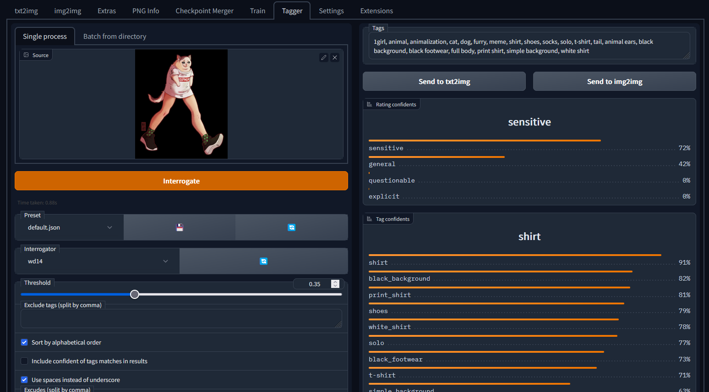

Tagger for [Automatic1111's WebUI](https://github.com/AUTOMATIC1111/stable-diffusion-webui)
---
Interrogate booru style tags for single or multiple image files using various models, such as DeepDanbooru.

## Disclaimer
I didn't make any models, and most of the code was heavily borrowed from the [DeepDanbooru](https://github.com/KichangKim/DeepDanbooru) and MrSmillingWolf's tagger.

Regarding this extension, it's a copy of [toriato](https://github.com/toriato/stable-diffusion-webui-wd14-tagger)'one, I changed 3 files to make it work in vladmandic webui; if you had errors ecc in toriato's extension, they will be there too.

## Installation
1. New, clean installation:
   - go to *Extensions* -> *Install from URL* -> Enter URL of this repository -> Press *Install* button. When you see it's been installed, close the command console and run again it.
   - or clone this repository under `extensions/`
      ```sh
      git clone https://github.com/GiusTex/vladmandic-WD14-Tagger.git extensions/vladmandic-WD14-Tagger
      ```
2. Fix already installed automatic1111-wd14-tagger extension:
   - move the extension from `automatic1111>extensions>stable-diffusion-webui-wd14-tagger` to `VladDiffusion>extensions`, and rename it "vladmandic-WD14-Tagger".
   - delete `vladmandic-WD14-Tagger>preload.py` and change it with the [preload.py](https://github.com/GiusTex/vladmandic-WD14-Tagger/blob/main/preload.py) from my repo, delete `vladmandic-WD14-Tagger>tagger>utils.py` and `ui.py`, and change them with [utils.py](https://github.com/GiusTex/vladmandic-WD14-Tagger/blob/main/tagger/utils.py) and [ui.py](https://github.com/GiusTex/vladmandic-WD14-Tagger/blob/main/tagger/ui.py) from my repo.
   - close the command console and run again it.

## Model comparison
[Model comparison](docs/model-comparison.md)

## Screenshot


Artwork made by [hecattaart](https://vk.com/hecattaart?w=wall-89063929_3767)

## Copyright

Public domain, except borrowed parts (e.g. `dbimutils.py`)
